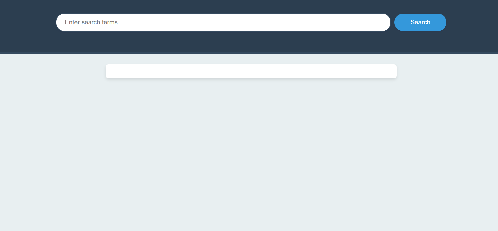
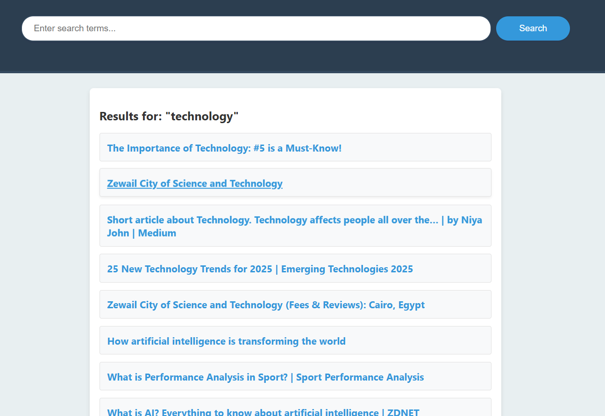
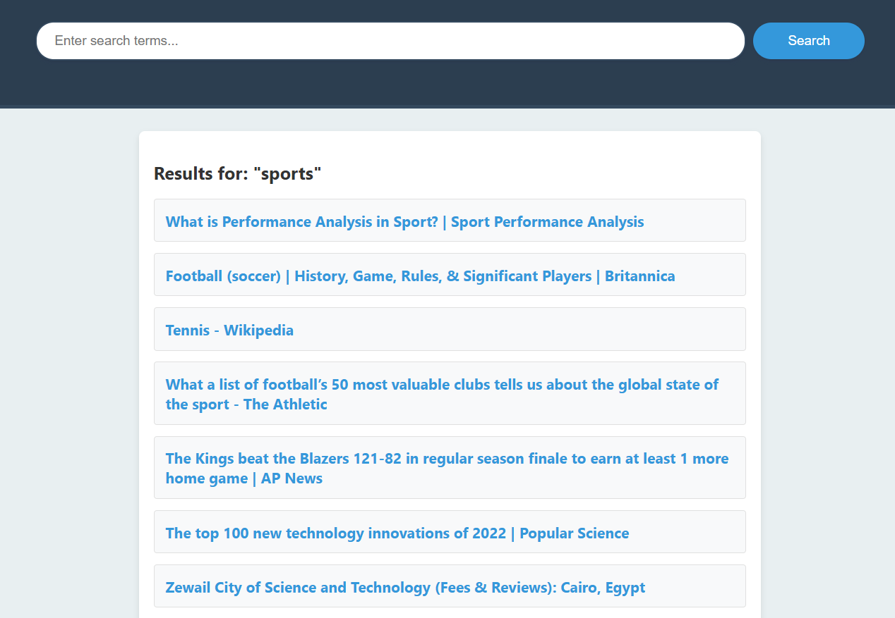
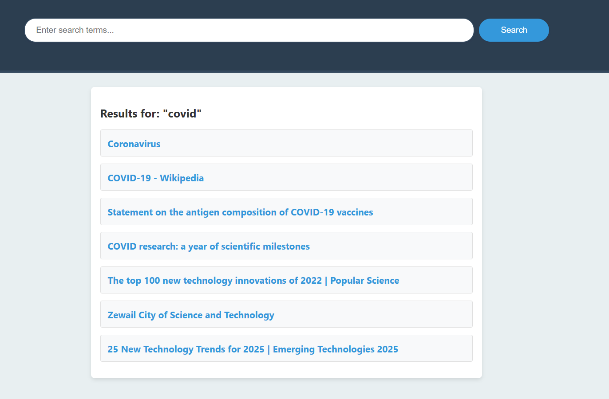

# Information Retrieval Project

This repository contains the implementation of an **Information Retrieval System** as part of the DSAI 201 Final Project spring 24. The system is designed to scrape, preprocess, index, and retrieve documents based on user queries. It also includes query expansion techniques and a user-friendly web interface.

## Features

- **Data Collection**: Scrapes data from various websites and stores it in a structured format.
- **Data Preprocessing**: Cleans and preprocesses text using tokenization, stopword removal, stemming, and lemmatization.
- **Indexing**: Builds an inverted index and term frequency dictionary for efficient retrieval.
- **Query Processing**: Retrieves relevant documents using TF-IDF and supports query expansion using ELMo embeddings.
- **Web Interface**: Provides a user-friendly search interface built with Flask and styled for a modern look.
- **Evaluation**: Measures retrieval performance using precision, recall, and F1-score.

## Installation

1. Clone the repository:
   ```bash
   git clone https://github.com/your-username/information-retrieval-project.git
   cd information-retrieval-project
   ```

2. Install the required Python packages:
   ```bash
   pip install -r requirements.txt
   ```

3. Ensure you have the following additional dependencies installed:
   - `python-terrier`
   - `nltk`
   - `flair`
   - `transformers`
   - `tensorflow_hub`
   - `flask`
   - `pyngrok`

## Usage

### Run the Jupyter Notebook
1. Open `Information_Retrieval_Project.ipynb` in Jupyter Notebook or Jupyter Lab.
2. Execute the cells step by step to scrape, preprocess, index, and retrieve documents.

### Start the Web Interface
1. Set up ngrok:
   - Install ngrok from [ngrok.com](https://ngrok.com/).
   - Sign up for an account and get your authentication token.
   - Run the following command to authenticate ngrok:
     ```bash
     ngrok authtoken <your-auth-token>
     ```
   - Add your ngrok authentication token in the appropriate cell in the notebook.

2. Run the Flask application (cell) to start the web interface.

## Screenshots

Below are some screenshots of the web interface and examples with different queries:

1. **Once Opened**  
   

2. **Search Results for Technology**  
   

3. **Search Results for Sports**  
   

4. **Search Results for COVID**  
   

## License
This project is licensed under the MIT License.
